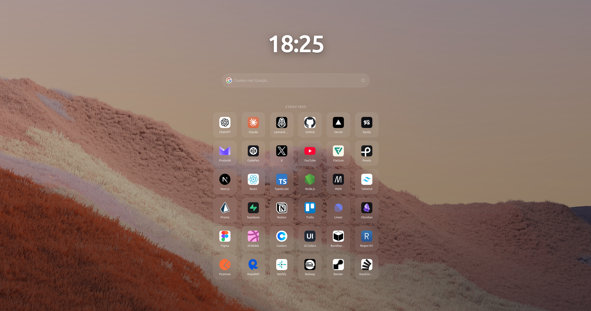

# DevHub

A modern and lightweight browser start page built with pure HTML, CSS, and JavaScript.

DevHub gives you a clean homepage with quick access to your favorite websites, a live clock, Google search, and a smooth glassmorphism-inspired interface.



## Highlights

- Minimal and distraction-free design
- Google search integration
- Custom bookmark shortcuts
- Live clock
- Smooth parallax background
- Responsive across desktop and mobile
- Zero dependencies
- No build tools required

## Getting Started

Clone the repository:

```bash
git clone https://github.com/Z3R0V1B3S/devhub.git
cd devhub
```

Open `index.html` in your browser.

To use DevHub as your homepage or new tab page, point your browser (or a new-tab extension) to the local `index.html` file.

## Customization

### Bookmarks

Edit `src/sites.js`:

```js
const sites = [
  { name: "GitHub", url: "https://github.com" },
  { name: "ChatGPT", url: "https://chatgpt.com" },
];
```

### Background Image

Replace:

```text
assets/background3.jpg
```

with your own image.

### Page Title

Edit the title shown above your bookmarks in `index.html`:

```html
<h2 class="title">Your Title</h2>
```

## Project Structure

```text
devhub/
├── assets/
│   ├── background3.jpg
│   └── screenshot.png
├── src/
│   ├── main.js
│   ├── sites.js
│   └── style.css
├── index.html
├── LICENSE
└── README.md
```

## Browser Support

DevHub works in all modern browsers, including:

- Chrome
- Firefox
- Edge
- Brave
- Arc
- Zen Browser

## License

Released under the MIT License.
